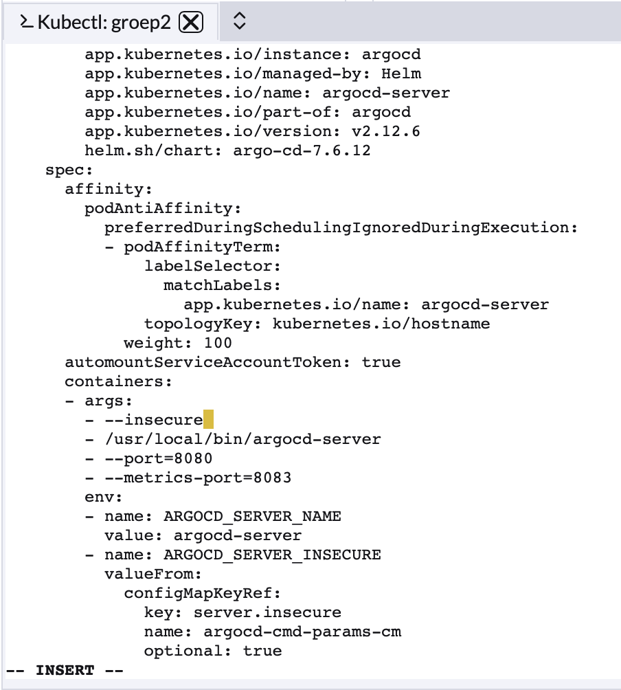
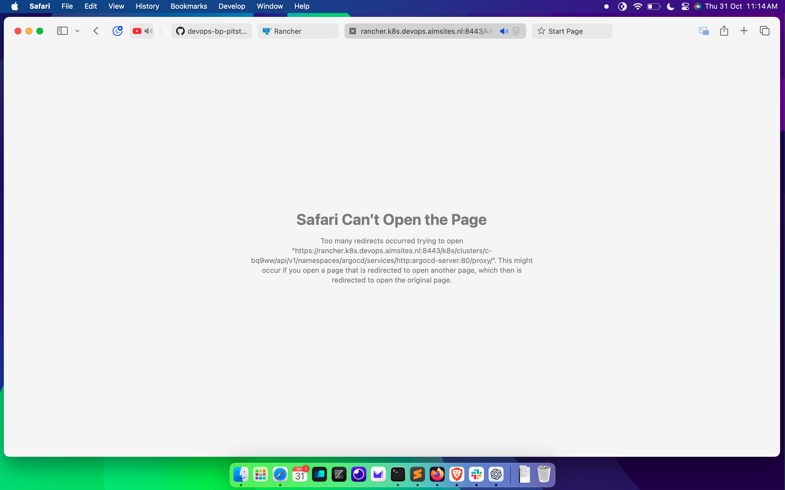
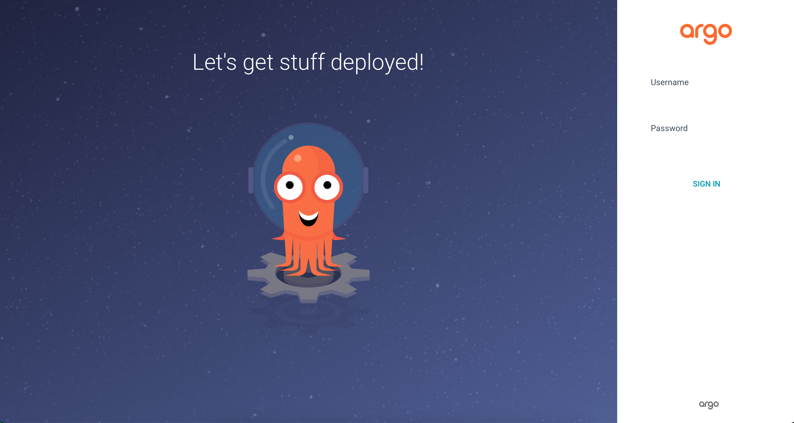
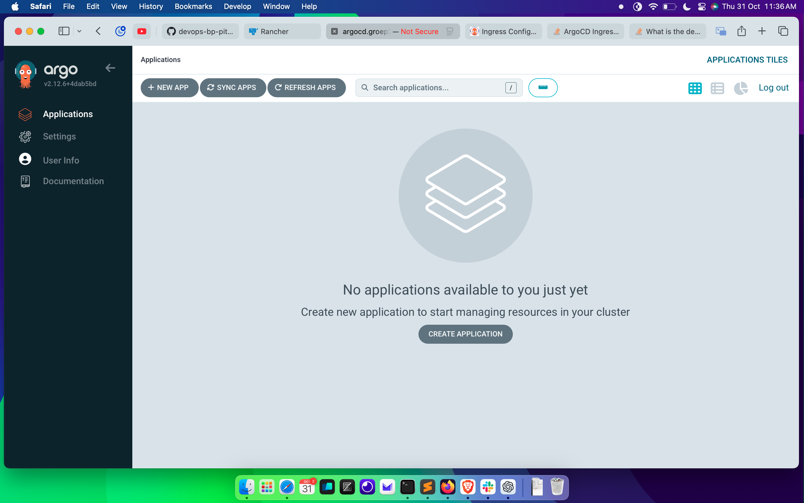
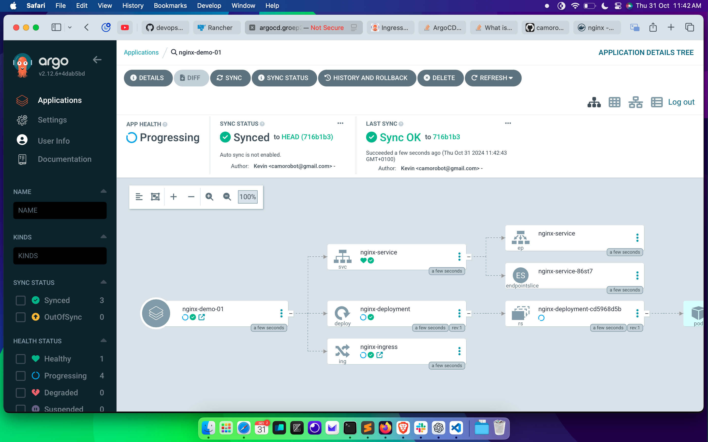

# Installatie van ArgoCD met NGINX Ingress Controller op Kubernetes

Deze handleiding beschrijft hoe je ArgoCD installeert op een Kubernetes-cluster, hoe je de NGINX Ingress-controller als standaard Ingress instelt, en hoe je het redirect-probleem oplost dat kan optreden bij de ArgoCD-server. 

---

## Installatie van ArgoCD

### Stappen voor installatie

1. **Verwijder Traefik (optioneel)**: Als je cluster standaard met Traefik is opgezet (zoals bij K3s of RKE2), kun je Traefik uitschakelen. Voor K3s en RKE2 kan dit door het volgende toe te voegen aan de opstartopties:

   ```bash
   sudo systemctl edit rke2-server
   ```

   Voeg de volgende regels toe:

   ```plaintext
   [Service]
   Environment="RKE2_SERVER_ARGS=--disable traefik"
   ```

   Herstart de server:

   ```bash
   sudo systemctl daemon-reload
   sudo systemctl restart rke2-server
   ```

2. **Installeer de NGINX Ingress-controller**: Voeg de NGINX Ingress-controller toe aan je cluster door het volgende commando uit te voeren:

   ```bash
   kubectl apply -f https://raw.githubusercontent.com/kubernetes/ingress-nginx/main/deploy/static/provider/cloud/deploy.yaml
   ```

3. **Controleer de Ingress-installatie**: Controleer of de NGINX Ingress-controller draait:

   ```bash
   kubectl get pods -n ingress-nginx
   ```

4. **ArgoCD-installatie met HTTP-only Ingress**: Installeer ArgoCD met een HTTP-only Ingress-configuratie zonder HTTPS of redirects:

   ```bash
   helm repo add argo https://argoproj.github.io/argo-helm
   helm repo update
   helm install argocd argo/argo-cd --namespace argocd --create-namespace \
     --set server.ingress.enabled=true \
     --set server.ingress.hosts[0]=argocd.groep2.k8s.devops.aimsites.nl \
     --set server.ingress.annotations."nginx\.ingress\.kubernetes\.io/backend-protocol"="HTTP" \
     --set configs.cm.url=http://argocd.groep2.k8s.devops.aimsites.nl
   ```

---

## Het Oplossen van het Redirect-probleem

Tijdens het testen kan er een redirect-probleem optreden, waarbij de ArgoCD-server constant probeert om te sturen naar HTTPS. Dit kan worden opgelost door een configuratieparameter aan te passen in de ConfigMap van ArgoCD.

1. **Open de ArgoCD ConfigMap**: Open de configuratie van de `argocd-cmd-params-cm` ConfigMap:

   ```bash
   kubectl edit configmap argocd-cmd-params-cm -n argocd -o yaml
   ```

2. **Wijzig de `server.insecure` optie**: Zoek in de ConfigMap naar `server.insecure` en verander deze van `false` naar `true`:

   ```yaml
   server.insecure: "true"
   ```

     
   _Figuur 1: aanpassen van de config file

     
   _Figuur 2: De redirect error die verschijnt in de browser wanneer ArgoCD probeert om te leiden naar HTTPS._

3. **Herstart de ArgoCD Server**: Sla de wijzigingen op en herstart de ArgoCD-server:

   ```bash
   kubectl delete pod -l app.kubernetes.io/name=argocd-server -n argocd
   ```

   Na de herstart zou ArgoCD toegankelijk moeten zijn zonder redirect-problemen. Als alles correct is ingesteld, zou je nu het ArgoCD login-scherm moeten zien:

     
   _Figuur 3: ArgoCD login-scherm._

---

## Een Repository Toevoegen aan ArgoCD

Zodra ArgoCD is ingesteld, kun je een repository toevoegen om de deployment te beheren. Hier is een voorbeeldconfiguratie voor een NGINX-applicatie die we willen beheren met ArgoCD.

1. **Open ArgoCD en Log in**: Na inloggen kun je de optie kiezen om een nieuwe applicatie toe te voegen en een Git-repository toe te wijzen. 

     
   _Figuur 4: Het scherm in ArgoCD waarin je de repository URL en branch kunt configureren._

2. **Voorbeeld NGINX Configuratie**: Voeg de volgende configuratie toe aan je repository om een NGINX Deployment, Service, en Ingress-resource aan te maken:

   ```yaml
   # NGINX Deployment
   apiVersion: apps/v1
   kind: Deployment
   metadata:
     name: nginx-deployment
     namespace: default
   spec:
     replicas: 1
     selector:
       matchLabels:
         app: nginx
     template:
       metadata:
         labels:
           app: nginx
       spec:
         containers:
         - name: nginx
           image: nginx:1.25
           ports:
           - containerPort: 80
   ---
   # NGINX Service
   apiVersion: v1
   kind: Service
   metadata:
     name: nginx-service
     namespace: default
   spec:
     type: ClusterIP
     selector:
       app: nginx
     ports:
       - protocol: TCP
         port: 80
         targetPort: 80
   ---
   # NGINX Ingress
   apiVersion: networking.k8s.io/v1
   kind: Ingress
   metadata:
     name: nginx-ingress
     namespace: default
     annotations:
       nginx.ingress.kubernetes.io/rewrite-target: /
       kubernetes.io/ingress.class: "nginx"
   spec:
     rules:
     - host: nginx-argocd-demo.groep2.k8s.devops.aimsites.nl 
       http:
         paths:
         - path: /
           pathType: Prefix
           backend:
             service:
               name: nginx-service
               port:
                 number: 80
   ```

3. **De Repository Synchroniseren**: Klik op "Sync" in ArgoCD om de applicatie te synchroniseren en de NGINX-applicatie uit te rollen.

     
   _Figuur 5: Het overzichtsscherm waarin de repository succesvol is ingeladen en gesynchroniseerd._

---

Met deze configuratie en stappen kun je ArgoCD gebruiken om de NGINX-applicatie te beheren via een HTTP-only NGINX Ingress-setup zonder redirects.