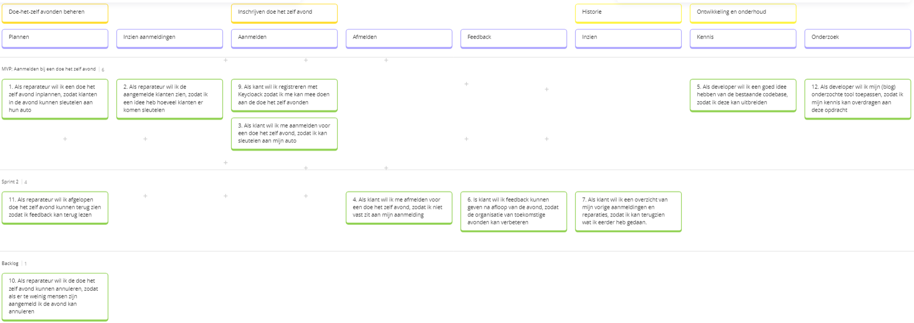

# Eigen bijdrage Mitchel Fleury

## 1. Code/platform bijdrage

Competenties: *DevOps-1 Continuous Delivery*

- Ik heb een opzet gedaan voor de microservice `diymanagementapi` ([Pull Request](https://github.com/hanaim-devops/devops-bp-pitstop-uitbreiding-team-knoppert/pull/33)).

## 2. Bijdrage app configuratie/containers/kubernetes

Competenties: *DevOps-2 Orchestration, Containerization*

- Voor de `diymanagementapi` heb ik een [dockerfile](https://github.com/hanaim-devops/devops-bp-pitstop-uitbreiding-team-knoppert/pull/33/files#diff-792105b15c623708f22bd3b3c2987481f9844a21e55e0c16135b897dc9bc32f6) gemaakt, zodat deze in de docker-compose gebruikt kan worden.
- Ik heb de dockerfile ook toegevoegd aan de [docker-compose](https://github.com/hanaim-devops/devops-bp-pitstop-uitbreiding-team-knoppert/pull/33/files#diff-cd2ae9f5a501d16253a461b919af1523e71916a984989885e6783203f4ee252a).
- Ik heb een `yaml` [file](https://github.com/hanaim-devops/devops-bp-pitstop-uitbreiding-team-knoppert/pull/33/files#diff-69d70eca58af131e036a380f7199148c965b9e9d9a91134788b0a19e144eb2d2) aangemaakt, zodat de `diymanagementapi` ook gebruikt wordt in Kubernetes. Deze file is ook toegevoegd aan het [start script](https://github.com/hanaim-devops/devops-bp-pitstop-uitbreiding-team-knoppert/pull/33/files#diff-b2373aaccf35da43b56fe43cc9a6af19d975ed713aeed548708c6df9793a8bb2).

## 3. Bijdrage versiebeheer, CI/CD pipeline en/of monitoring

Competenties: *DevOps-1 - Continuous Delivery*, *DevOps-3 GitOps*, *DevOps-5 - SlackOps*

## 4. Onderzoek

Competenties: *Nieuwsgierige houding*

## 5. Bijdrage code review/kwaliteit anderen en security

Competenties: *DevOps-7 - Attitude*, *DevOps-4 DevSecOps*

- Ik heb een [pull request](https://github.com/hanaim-devops/devops-bp-pitstop-uitbreiding-team-knoppert/pull/32) van Jelmer nagekeken. Bij deze PR heb ik een aantal comments achtergelaten. 2 comments gingen over 'TODO's' die nog in de code stonden. 2 comments gingen over GitHub Actions warnings. En ik had een vraag over wat een regel code deed, deze is beantwoord door Jelmer.

- Ik heb een [pull request](https://github.com/hanaim-devops/devops-bp-pitstop-uitbreiding-team-knoppert/pull/22) van Dirk nagekeken. Dit was een opzet van een service. Ik heb hier een comment achtergelaten dat ik nog de opzet voor de front-end miste.

## 6. Bijdrage documentatie

Competenties: *DevOps-6 Onderzoek*

- Ik heb bijgedrage aan het opstellen van userstories en deze te mappen op Miro. 
- Ik heb meegeholpen met het opstellen van acceptatiecriteria voor de opgestelde userstories. Deze staan in de [GitHub issues](https://github.com/hanaim-devops/devops-bp-pitstop-uitbreiding-team-knoppert/issues).

## 7. Bijdrage Agile werken, groepsproces, communicatie opdrachtgever en soft skills

Competenties: *DevOps-1 - Continuous Delivery*, *Agile*

- Ik heb een keer de DSU geleid. Ik nam de leiding en gaf iedereen om de beurt de mogelijkheid om te zeggen wat ze de dag ervoor hadden gedaan en wat ze die dag zouden gaan doen. Als laatst heb ik mezelf de beurt gegeven. Ik moest een keer ingrijpen, omdat we in details gingen over een taak en dit is niet de bedoeling tijdens de DSU.
  
## 8. Leerervaringen

Competenties: *DevOps-7 - Attitude*

## 9. Conclusie & feedback

Competenties: *DevOps-7 - Attitude*
